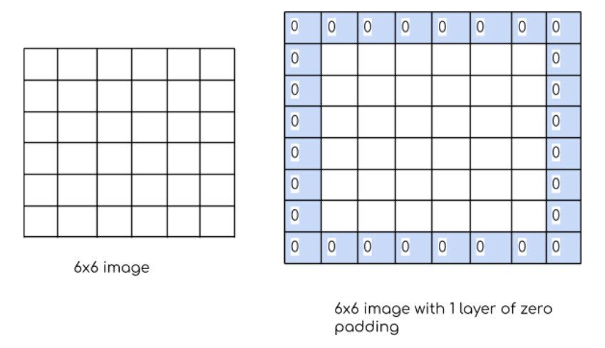
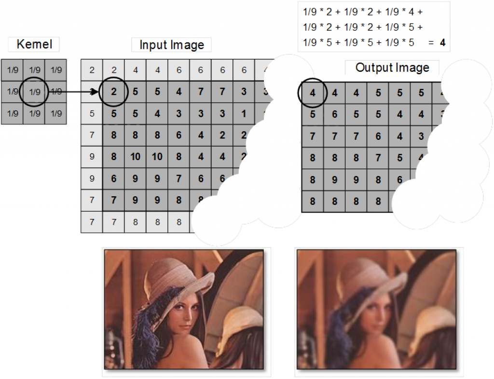
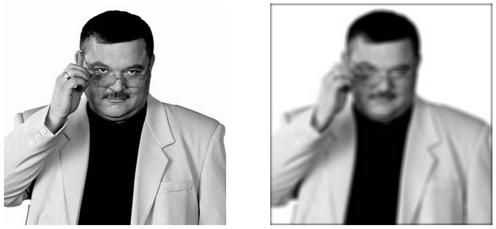

## Задача 1. Нечеткий парень

В этом задании перед вами стоит задача реализовать фильтр размытия, аналогичный фильтрам размытия из различных редакторов фото. Но прежде чем переходить к реализации самого фильтра размытия, необходимо выполнить подготовительные шаги.

### Часть 1. Паддингтон

Слово паддинг (англ. *padding*) буквально можно перевести, как отступ. В контексте текущей задачи паддингом мы будем называть рамку вокруг изображения, шириной в заданное число пикселей, заполненную нулями. На картинке ниже приведен пример добавления паддинга шириной в 1 пиксель к входному изображению.

Ваша задача - реализовать функцию добавления паддинга.

Допишите код функции `pad_image` в файле [task1](../../../solutions/sem02/lesson04/task1.py).

**Входные данные**:
- `image` - двумерный или трехмерный массив - черно-белое или RGB изображение. Элементы массива - восьмибитные целые беззнаковые числа.
- `pad_size` - натуральное число, ширина паддинга.

**Выходные данные**:
- Исходное изображение с добавленным паддингом. Т.е. `image`, заключенное в рамку из 0 шириной в `pad_size` пикселей.

*Сторонние эффекты*:
- Если значение `pad_size` меньше единицы, необходимо возбудить исключение `ValueError`.

**ВАЖНО**: в это задании запрещено использовать функцию `np.pad`. Решения с использованием `np.pad` будут оценены в 0 баллов!

### Часть 2. Размытие

Теперь мы готовы реализовывать фильтр размытия. Размытие изображения работает достаточно просто:

- Сначала задается размер окна размытия - $l_w$, которое можно интерпретировать, как степень размытия. Чем больше окно размытия, тем сильнее результирующая картинка будет размыта. Обычно в качестве размеров окна размытия используются нечетные целые числа.
- Следующий шаг - это применение паддинга к входному изображению размеров $N \times M$, причем ширина паддинга соответствует следующему выражению: $\lfloor\frac{l_w}{2}\rfloor$.  
- Затем, по всему изображению с паддингом запускается обход скользящим окном размеров $l_w \times l_w$, причем центр окна всегда находится в пикселях, соответствующих пикселям исходного изображения. Т.е. центр окна размытия проходит пиксели из области $[l_w, l_w + N] \times [l_w, l_w + M]$
- В каждом положении окна размытия вычисляется среднее значений пикселей, попавших в окно. Результат записывается в новый массив, тех же размеров, что и исходное изображение.

Ваша задача - реализовать функцию для размытия изображений.

Допишите код функции `blur_image` в файле [task1](../../../solutions/sem02/lesson04/task1.py).

**Входные данные**:
- `image` - двумерный или трехмерный массив - черно-белое или RGB изображение. Элементы массива - восьмибитные целые беззнаковые числа.
- `kernel_size` - натуральное нечетное число, размер окна размытия.

**Выходные данные**:
- Размытое изображение.

*Сторонние эффекты*:
- Если `kernel_size` четное число или `kernel_size` меньше 1, необходимо возбудить исключение `ValueError`.

Ожидаемый результат:

## Задача 2. Не вижу разницы

Представим, что вы занимаетесь разработкой некоторого алгоритма дорисовки черно-белых изображений. Для дорисовки используется некоторая модель машинного обучения. Вызов модели занимает продолжительное время, и в некоторых случаях этот вызов не оправдан. Например, дорисовка с помощью модели машинного обучения не оправдана, когда изображение является однотонным (очень много больших областей одного и того же цвета). В этом случае можно было бы использовать цвет однотонных областей для дорисовки требуемых частей изображения.

Для реализации такого подхода необходимо разработать алгоритм, который позволял бы определить самый распространенный цвет на изображении. Однако есть нюанс. Некоторые цвета черно-белого изображения плохо различимы человеком, и их необходимо рассматривать как один и тот же цвет. Определить плохо различимые цвета можно с помощью критерия `|image[i][j] - image[k][l]| < treshold`. Т.е. если значение разности яркости двух пикселей не превышает заранее заданного порога, то эти пиксели считаются пикселями одного цвета.

Необходимо реализовать функцию для определения самого распространенного цвета черно-белого изображения с учетом оговоренных особенностей восприятия цвета. Также необходимо рассчитать процент пикселей изображения, окрашенных в самый распространенный цвет, чтобы понимать, возможна ли тривиальная дорисовка или нет.

Допишите код функции pad_image в файле [task2](../../../solutions/sem02/lesson04/task2.py).

**Входные данные**:
- `image` - двумерный массив - черно-белое изображение. Элементы массива - восьмибитные целые беззнаковые числа.
- `threshold` - натуральное число, порог для выявления неразличимых цветов.

**Выходные данные**:
- Кортеж. Первый элемент кортежа - восьмибитное целое беззнаковое число, самый распространенный цвет. Второй элемент кортежа - процент пикселей изображения, окрашенных в самый распространенный цвет.

*Сторонние эффекты*:
- Если значение `threshold` меньше единицы, необходимо возбудить исключение `ValueError`.

