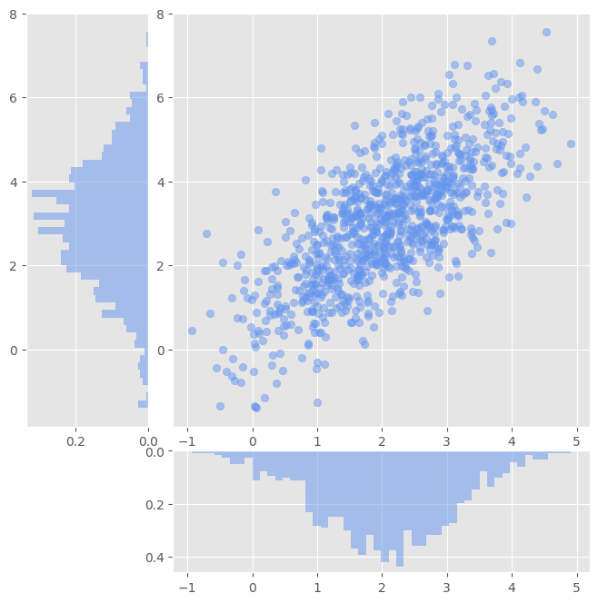
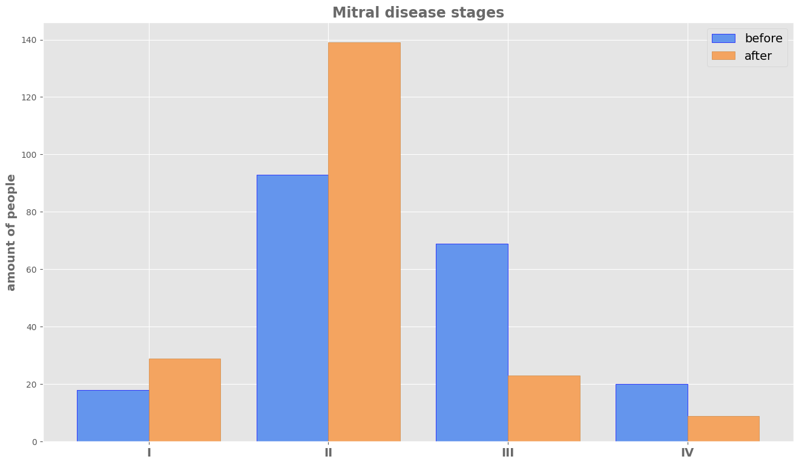

## Задача 1. Распределения на любой вкус

Реализуйте функцию `visualize_diagrams`, которая позволяет построить диаграмму рассеяния данных и распределения данных вдоль координатных осей.

Допишите код функции `visualize_diagrams` в файле [task1](../../../solutions/sem02/lesson07/task1.py).

**Входные данные**:
- `abscissa` - одномерный `np.ndarray` чисел с плавающей точкой - абсциссы визуализируемых точек.
- `ordinates` - одномерный `np.ndarray` чисел с плавающей точкой - ординаты визуализируемых точек.
-  `diagram_type` - строка, тип визуализации распределения данных вдоль осей. `diagram_type` должен принимать одно из трех значений: `hist` - в этом случае распределение строится в виде гистограммы, `violin` в этом случае распределение строится в виде скрипичной диаграммы, `box` - в этом случае распределение строится в виде ящика с усами.

**Сторонние эффекты**:
- После выполнения функции на экране должно отображаться изображение с визуализацией, похожей на визуализацию из последнего примера с семинара (добавьте что-то от себя, например, поменяйте цвет или оформление):


- Если размеры массивов `abscissa` и `ordinates` не равны, необходимо возбудить исключение `ShapeMismatchError`.
- Если значение `diagram_type` не является допустимым значением, необходимо возбудить `ValueError`.

## Задача 2. Сердечная задача

Представим, что вы работаете аналитиком данных в некоторой медицинской компании, которая занимается изготовлением кардио-имплантов. В данный момент кампания планирует запустить в серийное производство новый кардио-имплант, устанавливаемый при митральной недостаточности (неправильное функционирование митрального клапана сердца, при котором возникает обратное движение крови из левого желудочка в левое предсердие во время сокращения желудочков сердца вследствие неполного смыкания створок клапана). Прежде, чем запускать новую разработку в серийное производство было произведено исследования эффективности импланта. Исследование происходило следующим образом:
- У пациентов, принимающих участие в исследовании, фиксировалась текущая степень митральной недостаточности. Всего степеней митральное недостаточности 4: первая степень - самая легкая, четвертая - самая опасная.
- Затем участникам исследования устанавливался кардио-имплант.
- Спустя некоторое время повторно определялась степень митральной недостаточности.

Данные о степенях митральной недостаточности пациентов до и после установки импланта были записаны в файл [`medic_data.json`](../../../solutions/sem02/lesson07/data/medic_data.json) в следующем формате:
```python
{
    "before": [
        "I",
        "II",
        ...
    ],
    "after": [
        "I",
        "II",
        ...
    ]
}
```

Ключу `"before"` соответствует список со степенями митральной недостаточности пациентов до установки импланта, а ключу `"after"` - после. Сами степени записаны в виде строковых литералов, которые стоит интерпретировать, как числа, записанные латинскими цифрами.

Ваша задача - реализовать функционал для визуализации распределения пациентов по степеням митральной недостаточности до и после установки импланта. Для этого вам необходимо прочитать данные из файла [`medic_data.json`](../../../solutions/sem02/lesson07/data/medic_data.json), рассчитать число пациентов для каждой группы митральной недостаточности, построить столбчатые диаграммы, сохранить изображение с диаграммами в память компьютера.

В результате выполнения приведенной последовательности действий вы должны получить картинку, похожую на эту (добавьте что-то от себя, например, поменяйте цвет или оформление):


Напишите код в файле [task2](../../../solutions/sem02/lesson07/task2.py).

Проанализируйте, полученную вами диаграмму. Какой вывод об эффективности импланта можно сделать, если стадия I самая безопасная, а стадия IV - самая опасная?
