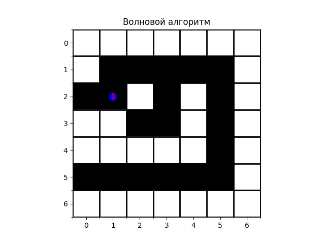

## Задача №1. Сигналы.

В данной задаче вам предстоит реализовать анимацию модулированного сигнала.

Модуляция — это процесс изменения параметров несущего сигнала (например, амплитуды, частоты или фазы) в зависимости от информационного (модулирующего) сигнала. В данной задаче рассматривается амплитудная модуляция (AM) , при которой амплитуда несущего сигнала изменяется в соответствии с модулирующим сигналом M(t). Математически модулированный сигнал описывается формулой:

$$ s(t)=M(t)⋅sin(2πf_ct) $$
где:
- $M(t)$ — функция модуляции (определяет изменение амплитуды несущего сигнала);
- $f_c$ — частота несущего сигнала.

*Входные данные*:
- `modulation` - `Callable`-объект (функция) или `None`. Если передается функция, она определяет модуляцию сигнала. Если None, то модуляция не осуществляется, и используется только несущий сигнал.
- `fc` - Частота несущего сигнала (Гц).
- `num_frames` - Количество кадров анимации.
- `plot_duration` - Длительность интервала времени (в секундах), который будет отображаться на графике в каждый момент анимации.
- `time_step` - Шаг дискретизации времени ($Δt$), используемый для вычисления значений сигнала. По-умолчанию 0.001 секунд.
- `animation_step` - Шаг анимации, пределяющий, разницу по времени между кадрами, то есть насколько сдвигается график. По-умолчанию 0.01 секунд.
- `save_path` - Путь к файлу, куда будет сохранена анимация, если путь `""`, то сохранять не надо,. По-умолчанию `""`.

*Выходные данные*:
- Анимация - График, показывающий динамику модулированного сигнала. На каждом кадре отображается фрагмент сигнала длительностью plot_duration.
- Файл GIF - Анимация сохраняется в файл по указанному пути save_path.

**Требования**:

В данной задаче у вас нет заготовки решения. Вы вольны решать задачу так, как считаете нужным. Однако при проверки ваших решений семинаристы будут уделять внимание следующим аспектам:

- **Правильность решения**. Важно, чтобы ваше решение работало так, как ожидается. Решение должно включать считывание данных из файла, построение диаграммы на основе считанных данных, сохранение картинки в память компьютера. Неправильно работающие решения будут оценены в 0 баллов.
- **Структура решения**. Решение должно быть аккуратным. Код должен быть разбит на логические блоки: функции или методы класса. Решение, реализованное в императивном стиле (все команды выполнены на уровне модуля) будет оценено максимум в 5 баллов из 10. При разбиении кода на логические блоки избегайте смешения логики (вычисления и построение диаграмм в одной функции или чтение данных и построение диаграммы в одной функции). Смешение логики также будет штрафоваться на усмотрение семинариста.
- **Оформление**. Оформляйте ваш код аккуратно. Используйте `flake8` вместе с конфигом из корня репозитория для проверки качества вашего кода. Также избегайте повторений. Если один и тот же код был скопирован и использован два раза, семинарист может снизить вашу оценку на свое усмотрение.

**Пример анимации**:

*Примечание*: Ваш вариант может отличаться от примера.

# Задача №2 Выход есть!

Волновой алгоритм (алгоритм Ли) — это метод поиска кратчайшего пути на двумерной сетке или графе. Он используется для нахождения пути между двумя точками в лабиринте, где каждая клетка может быть либо стеной (непроходимой), либо проходом (проходимой). Алгоритм основан на принципе "волнового распространения": из начальной точки (старта) волна распространяется во все стороны, постепенно заполняя доступные клетки, пока не достигнет конечной точки (финиша).

**Основные шаги алгоритма**:
1. **Инициализация**:
   - Начальная точка (старт) помечается числом `0`.
   - Все остальные клетки лабиринта инициализируются значением, обозначающим "не посещено" (например, `-1`).

2. **Распространение волны**:
   - На каждом шаге алгоритм рассматривает все клетки, помеченные текущим значением (например, `n`).
   - Для каждой такой клетки проверяются её соседи (вверх, вниз, влево, вправо). Если соседняя клетка является проходом (`1`) и ещё не посещена (значение `-1`), она помечается значением `n + 1`.
   - Процесс продолжается до тех пор, пока волна не достигнет конечной точки (финиша) или не будут обработаны все доступные клетки.

3. **Восстановление пути**:
   - Если волна достигла финиша, кратчайший путь восстанавливается "обратным ходом":
     - Начиная с финиша, двигаются к соседней клетке с меньшим значением (на единицу).
     - Процесс повторяется, пока не будет достигнут старт.
   - Если волна не достигла финиша (например, финиш окружён стенами), путь не существует.

Необходимо реализовать функцию, которая будет анимировать процесс работы волнового алгоритма для поиска пути в лабиринте. Лабиринт представлен в виде двумерного массива `numpy.ndarray`, где:
- `0` — это стена (непроходимая клетка),
- `1` — это проход (проходимая клетка).

Функция должна визуализировать процесс распространения волны и конечный путь, если он существует. Если путь не существует, функция должна сообщить об этом.

*Входные аргументы*:

- `maze` (`numpy.ndarray`) — двумерный массив, представляющий лабиринт. Элементы массива:
   - `0` — стена,
   - `1` — проход.
- `start` (`Tuple[int, int]`) — координаты начальной точки (строка, столбец).
- `end` (`Tuple[int, int]`) — координаты конечной точки (строка, столбец).
- `save_path` (`str`) — путь к файлу, в который нужно сохранить анимацию. Если строка пустая (`""`), то сохранять анимацию не нужно.

*Выходное значение*:

- Анимация - График, показывающий рабюоту волнового алгоритма.
- Файл GIF - Анимация сохраняется в файл по указанному пути save_path.

**Требования**:

В данной задаче у вас нет заготовки решения. Вы вольны решать задачу так, как считаете нужным. Однако при проверки ваших решений семинаристы будут уделять внимание следующим аспектам:

- **Правильность решения**. Важно, чтобы ваше решение работало так, как ожидается. Решение должно включать считывание данных из файла, построение диаграммы на основе считанных данных, сохранение картинки в память компьютера. Неправильно работающие решения будут оценены в 0 баллов.
- **Структура решения**. Решение должно быть аккуратным. Код должен быть разбит на логические блоки: функции или методы класса. Решение, реализованное в императивном стиле (все команды выполнены на уровне модуля) будет оценено максимум в 5 баллов из 10. При разбиении кода на логические блоки избегайте смешения логики (вычисления и построение диаграмм в одной функции или чтение данных и построение диаграммы в одной функции). Смешение логики также будет штрафоваться на усмотрение семинариста.
- **Оформление**. Оформляйте ваш код аккуратно. Используйте `flake8` вместе с конфигом из корня репозитория для проверки качества вашего кода. Также избегайте повторений. Если один и тот же код был скопирован и использован два раза, семинарист может снизить вашу оценку на свое усмотрение.

**Пример анимации**: 

*Примечание*: Ваш вариант может отличаться от примера.